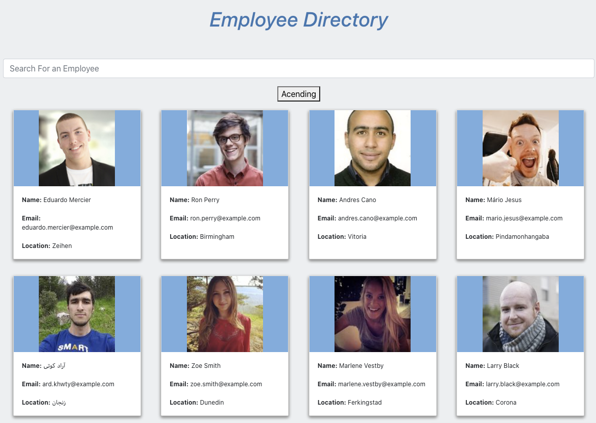

# React-Directory

This is an example of an employee directory that I created using the React framework. I utilized a free API on https://randomuser.me/ to generate random users and populate the application with 'employees'. The three main React components to the application were the Title, Search Bar, and Employee Cards. The search functionality is dynamic so it will constantly filter the employees based on your keystrokes. 

Here is a link to the deployed application: https://klynch94.github.io/React-Directory/

Sample of the directory:

